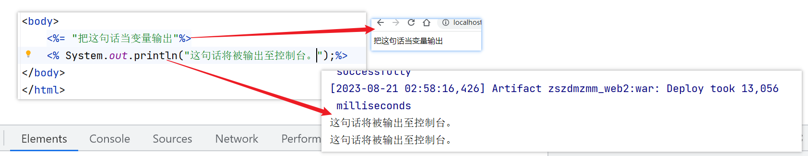
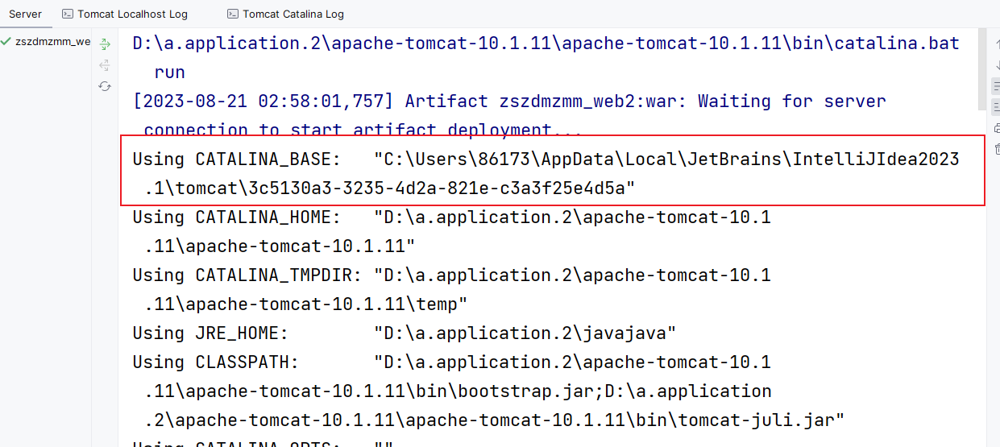
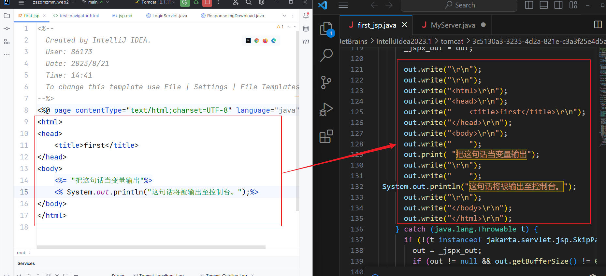
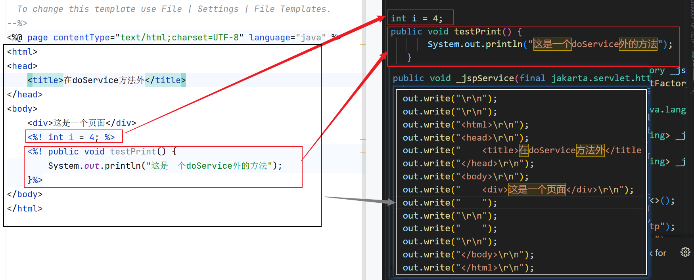
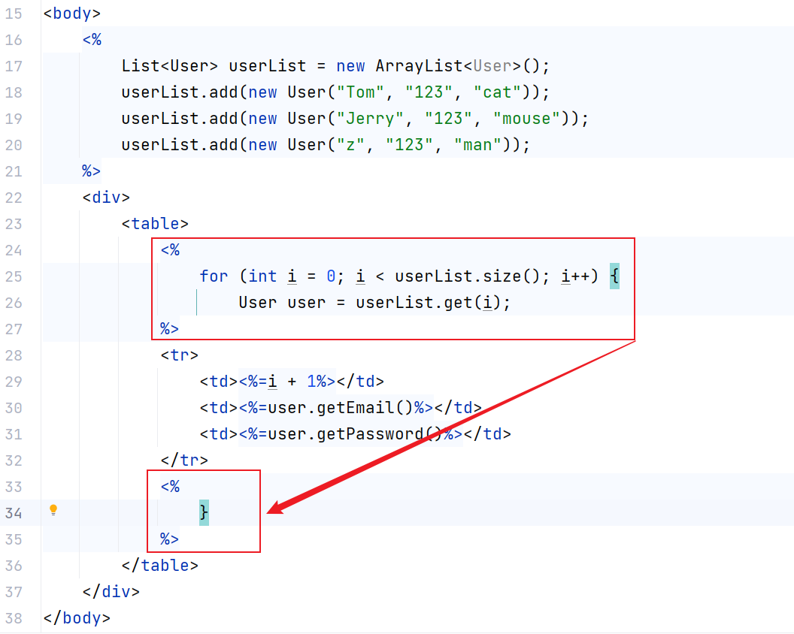

### jsp结合了html与java，使动态页面的书写更加方便
##### 1.jsp的两种输出方式：<% %>标签 与<%= %>标签

##### 2.jsp文件转化成java1与class文件可以在以下路径找到

到达指定路径后继续往下 例如：  
\work\Catalina\localhost\zszdmzmm_web2_war\org\apache\jsp\jsp
##### 3.jsp本质上是servlet,其转化方式如下。

##### 4.<%! %>标签：将state和behavior写在_jspService()方法之外

可以看到：红框中的代码都在_jspService()方法之外。  
##### 5.通过循环在页面上添加元素
切记java与html的代码各司其职：
