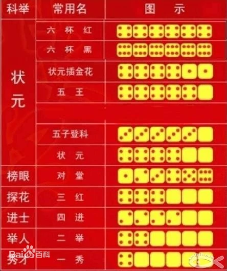
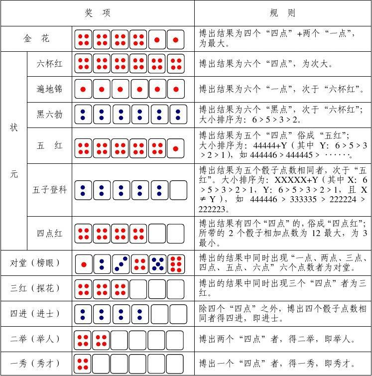

### 博饼规则 
#### 流程
1. 五至十人参与，可多可少，首先指定1人（一般是本桌年长位高者）取两个骰子扔出数点，如n点，由扔者开始逆时针方向数到第n个人，该人为本次博饼的起博者。
2. 依次摇色子直至奖品发完或特定色子型出现。
#### 色子型大小等级
从小到大为：
1. 有1个“四点”的得一秀饼(秀才)。
2. 有2个“四点”的得二举饼(举人)。 
3. 有4个相同点数的（红四除外）得四进饼(进士)。
4. 有3个“四点”的得三红饼。
5. 若骰子点数分别为1至6顺序排列着的得对堂饼(榜眼，探花)。
6. 状元有很多等级，以下状元等级是从小到大排列，具体为：若是有4个红的“四点”，则为状元，比较另外两个骰子点数的大小，点数大者为胜。
7. 有5个相同点数的，俗成“五子登科”，比起4个“四点红”的状元要大。首先，5个红4最大，叫“五皇”后面带的那个不同的叫点数，如：5个4带一个1，那么叫五皇带一，五皇带六为最大；再者，其他数字的5个相同，为“五子”，然后比不同的那一个几点，点数大者胜。（而五子当中就没有比较相同的那5个的点数了。）
8. 若是4个红的“四点”加上2个“一点”，则称为“状元插金花”。
9. 若是6个除“四”以外的点数，称为“六抔黑”依俗是关灯大家抢饼，比较晦气，但现在，几乎不抢了。“六抔黑”不算状元。
10. 若是6个“四点”，称为“六抔红”，是最大的状元，可拿走所有奖品。所有的奖品都拿完了才算博饼结束，就算状元出现了，但其他的份额仍有奖品，那么这局博饼就不能算结束。  

另有多种规则，在状元部分略有差异，例如：  
